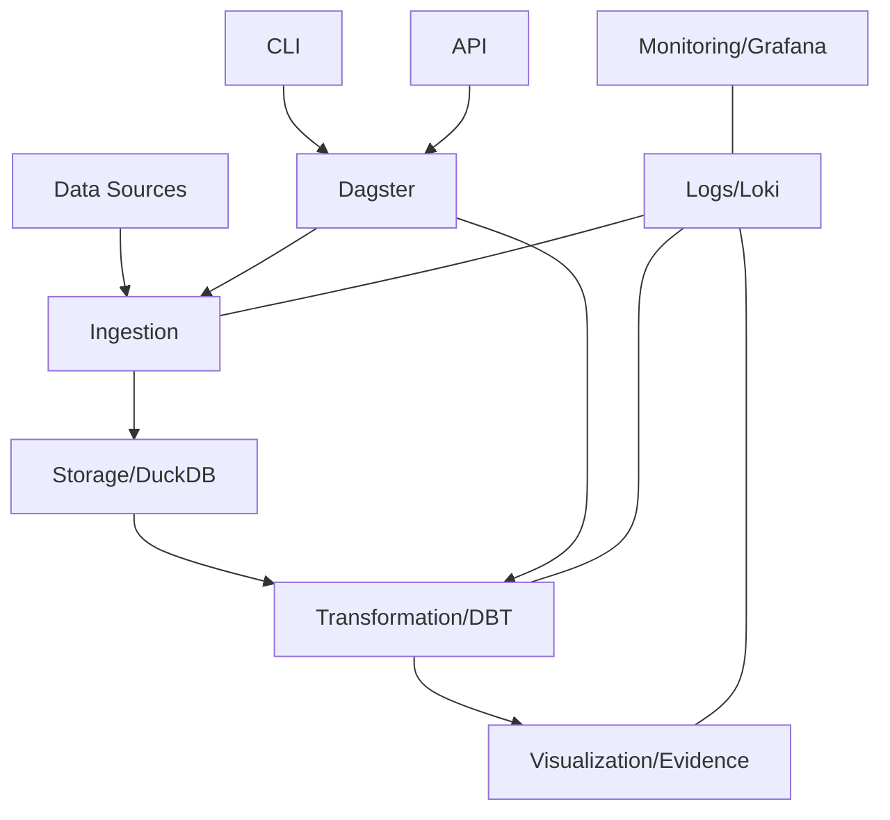

# DATAFLOW Documentation

DATAFLOW is a modern, modular data warehouse platform designed to streamline data ingestion, transformation, and visualization workflows.

## Overview

DATAFLOW provides a unified platform for:

- **Data Ingestion**: Extract data from various sources
- **Data Transformation**: Clean, normalize, and transform data using powerful tools
- **Data Visualization**: Create interactive dashboards and reports
- **Workflow Orchestration**: Schedule and monitor data pipelines

## Key Features

- **Modular Architecture**: Plug-and-play components that work seamlessly together
- **Extensible Workflow System**: Easily create custom workflows for different data sources
- **Developer-Friendly**: CLI tools, API endpoints, and comprehensive documentation
- **Integrated Observability**: Built-in logging, monitoring, and alerting

## Getting Started

To get started with DATAFLOW:

1. Follow the [Onboarding Guide](onboarding.md) to set up your environment
2. Learn about the [CLI](cli_usage.md) and [API](api.md)
3. Review [Environment Variables](environment_variables.md) for configuration
4. Check out [Workflow Authoring](workflows.md) to create custom workflows

## Architecture

## Components

- **Storage**: DuckDB, PostgreSQL, Minio
- **Orchestration**: Dagster
- **Transformation**: DBT
- **Visualization**: Evidence
- **Monitoring**: Grafana, Loki, Promtail
- **Interfaces**: CLI, API (FastAPI)
