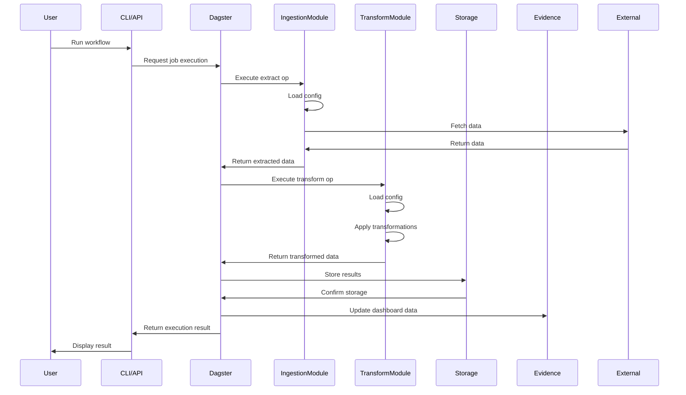

# Workflow Authoring Guide

DATAFLOW uses a workflow-centric approach where each data pipeline is organized as a self-contained workflow. This document explains how to author and work with workflows.

## Workflow Structure

Each workflow follows this directory structure:

```
src/dataflow/workflows/<workflow_name>/
  __init__.py
  ingestion.py      # Data extraction logic
  transform.py      # Data transformation logic
  assets.py         # Dagster assets/resources (optional)
  dagster_job.py    # Dagster job/op definitions, registry decorator
  config.yaml       # Workflow-specific config
  dbt/              # DBT models for this workflow
  evidence/         # Evidence dashboards for this workflow
  tests/            # Unit and integration tests for this workflow
```

## Setting Up a New Workflow

To create a new workflow, follow these steps:

1. Create the workflow directory structure:

```bash
mkdir -p src/dataflow/workflows/my_workflow/{evidence,dbt,tests}
touch src/dataflow/workflows/my_workflow/__init__.py
touch src/dataflow/workflows/my_workflow/ingestion.py
touch src/dataflow/workflows/my_workflow/transform.py
touch src/dataflow/workflows/my_workflow/dagster_job.py
touch src/dataflow/workflows/my_workflow/config.yaml
```

2. Initialize the Evidence dashboard for the workflow:

```bash
docker run -v=$(pwd)/src/dataflow/workflows/my_workflow/evidence:/evidence-workspace -it --rm evidencedev/devenv:latest --init
```

3. Implement your workflow following the guidance in the [Workflow Authoring Checklist](#workflow-authoring-checklist) section.

## Workflow Components

### 1. Configuration (config.yaml)

The `config.yaml` file defines workflow-specific configuration:

```yaml
# Sample config.yaml
workflow:
  name: "My Workflow"
  description: "Extracts and processes data from Source X"
  schedule: "0 0 * * *" # Daily at midnight (cron format)

ingestion:
  source:
    type: "api"
    url: "https://api.example.com/data"
    auth_type: "bearer_token"
  parameters:
    batch_size: 100
    max_retries: R

transformation:
  stages:
    - name: "cleaning"
      options:
        remove_duplicates: true
    - name: "enrichment"
      options:
        add_timestamps: true
```

### 2. Ingestion (ingestion.py)

The `ingestion.py` file handles data extraction:

```python
from dataflow.shared.logging import get_logger
from dataflow.shared.config import load_config

logger = get_logger(__name__)

def extract_data(params: dict) -> dict:
    """
    Extract data from the source specified in the workflow config.

    Args:
        params: Dictionary of parameters for extraction

    Returns:
        Dictionary containing extracted data and metadata
    """
    config = load_config("my_workflow")
    source_config = config.get("ingestion", {}).get("source", {})

    logger.info(f"Extracting data from {source_config.get('type')}")

    # Implement extraction logic here based on source_config

    return {
        "data": [...],  # Extracted data
        "metadata": {
            "source": source_config.get("type"),
            "record_count": len(data),
            "timestamp": datetime.now().isoformat()
        }
    }
```

### 3. Transformation (transform.py)

The `transform.py` file handles data transformation:

```python
from dataflow.shared.logging import get_logger
from dataflow.shared.config import load_config
import pandas as pd

logger = get_logger(__name__)

def transform_data(data: dict) -> dict:
    """
    Transform extracted data according to workflow configuration.

    Args:
        data: Dictionary containing extracted data and metadata

    Returns:
        Dictionary with transformed data and updated metadata
    """
    config = load_config("my_workflow")
    transform_config = config.get("transformation", {})

    df = pd.DataFrame(data["data"])

    for stage in transform_config.get("stages", []):
        stage_name = stage.get("name")
        options = stage.get("options", {})

        logger.info(f"Running transformation stage: {stage_name}")

        # Implement transformation logic for each stage
        if stage_name == "cleaning":
            if options.get("remove_duplicates"):
                df = df.drop_duplicates()
        elif stage_name == "enrichment":
            if options.get("add_timestamps"):
                df["processed_at"] = datetime.now().isoformat()

    return {
        "data": df.to_dict(orient="records"),
        "metadata": {
            **data["metadata"],
            "transformation_stages": [s["name"] for s in transform_config.get("stages", [])]
        }
    }
```

### 4. Dagster Job (dagster_job.py)

The `dagster_job.py` file wires everything together as a Dagster job:

```python
from dagster import job, op
from dataflow.workflows.registry import register_workflow

from .ingestion import extract_data
from .transform import transform_data

@op
def extract():
    return extract_data(params={})

@op
def transform(extract_result):
    return transform_data(extract_result)

@op
def load(transform_result):
    # Implement loading logic here
    pass

@job
def my_workflow_job():
    load(transform(extract()))

# Register the workflow with DATAFLOW
register_workflow(
    workflow_id="my_workflow",
    job=my_workflow_job,
    description="My workflow for processing data from Source X"
)
```

## Working with Evidence Dashboards

Each workflow has its own Evidence dashboard in the `evidence/` directory. To work with a workflow's Evidence dashboard:

1. Start the Evidence service:

```bash
docker-compose up -d evidence
```

2. Access the dashboard at http://localhost:9000

3. Develop the dashboard by editing files in the workflow's `evidence/` directory:
   - Create pages in `evidence/pages/`
   - Define data sources in `evidence/sources/`
   - Add custom components in `evidence/components/` (optional)

## Testing Workflows

Each workflow should have comprehensive tests in the `tests/` directory:

```
src/dataflow/workflows/my_workflow/tests/
  test_ingestion.py     # Test data extraction
  test_transform.py     # Test data transformation
  test_integration.py   # Test the entire workflow pipeline
```

## Running Workflows

Workflows are orchestrated by Dagster. To run a workflow:

1. Start the Dagster service:

```bash
docker-compose up -d dagster
```

2. Access the Dagster UI at http://localhost:3000

3. Navigate to the workflow job and run it manually or set up a schedule.

You can also run workflows via the CLI:

```bash
dataflow workflow run my_workflow
```

Or via the API:

```bash
curl -X POST http://localhost:8000/api/v1/workflows/my_workflow/run
```

## Workflow Execution Sequence

The following sequence diagram illustrates how a workflow executes:



## Workflow Authoring Checklist

Use this checklist when creating a new workflow:

### Planning

- [ ] Define the data source(s) and required credentials/authentication
- [ ] Identify transformation requirements
- [ ] Determine output format and visualization needs
- [ ] Establish error handling and validation approach

### Implementation

- [ ] Create the workflow directory structure
- [ ] Create `config.yaml` with workflow configuration
- [ ] Implement data extraction in `ingestion.py`
- [ ] Implement data transformation in `transform.py`
- [ ] Create Dagster job in `dagster_job.py`
- [ ] Register the workflow with the registry
- [ ] Create DBT models (if needed)
- [ ] Create Evidence dashboard

### Testing

- [ ] Add unit tests for ingestion
- [ ] Add unit tests for transformation
- [ ] Add integration test for the full workflow
- [ ] Test error handling and edge cases

### Documentation

- [ ] Document the workflow purpose and data flow
- [ ] Document configuration options
- [ ] Document Evidence dashboard capabilities
- [ ] Update project-level documentation (if needed)

## Best Practices

- Follow the single responsibility principle for each module
- Use type hints consistently
- Handle errors gracefully with appropriate logging
- Make configuration explicit and validate it early
- Write thorough tests, including for error conditions
- Document your code and workflow functionality
- Make dashboards user-friendly with clear labels and instructions
